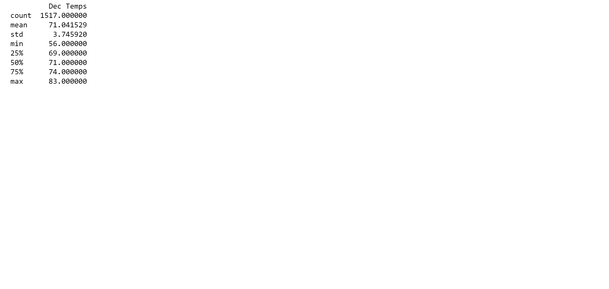

# surfs_up

This project explores the power of data storage and Rrtrieval to produce an analyis of temperature trends in Oahu, Hawaii. Specifically, summary statistics of temperature data were requested for the months of June and December, in order to determine if a prospective surf and ice cream shop business can sustainably operate year-round as opposed to a seasonal business.

Summary Statistics DataFrame: June vs December Temperatures

The average recorded temperature in June is about 75 degrees F, 4 degrees higher than the average temp in December.
This represents a -5% change in average temperature from June to December
The frequency of temperatures recorded in June tends to have a much more normal.
The December temperatures seem to be more variable than those in June given its larger range in recorded temperatures (comparing the max vs min temp of each month)

In Summary, even though temperatures recorded in December seem to vary more than those of June, December would still provide appropriate weather conditions for both surfing and demand in ice cream. The average temperatures in June and December only differ by 4 degree
